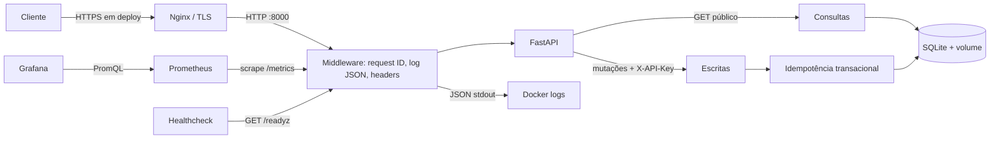

# devops-fastapi-lab

Projeto-vitrine público e reproduzível de uma API FastAPI com práticas de entrega, segurança, observabilidade e operação. É um laboratório demonstrativo: **não representa uma carga real de produção, não possui SLA e não publica métricas de desempenho inventadas**.

## O que está incluído

- CRUD de tarefas em SQLite e documentação OpenAPI em `/docs`;
- leitura pública e autenticação configurável por API key nas operações mutáveis;
- probes separadas de liveness (`/health/live`) e readiness (`/readyz`);
- request ID em toda resposta, logs de requisição em JSON e cabeçalhos HTTP defensivos;
- criação idempotente opcional com `Idempotency-Key`;
- métricas Prometheus em `/metrics`, com contagem e latência por rota normalizada;
- Prometheus e dashboard Grafana provisionados localmente pelo Docker Compose;
- testes com cobertura mínima de 90%, Ruff e mypy estrito;
- contêiner não-root, capabilities removidas, healthcheck e limites no Compose;
- CI para qualidade, imagem e scan Trivy; Dependabot para Python, Actions e Docker;
- scripts de backup consistente e restauração atômica do SQLite.

## Arquitetura



A aplicação usa um único processo Uvicorn porque SQLite serializa escritas e o volume é local. Para múltiplas réplicas, migre a persistência para PostgreSQL antes de escalar. O readiness executa `SELECT 1`; liveness apenas confirma que o processo HTTP responde. Labels das métricas usam o template da rota, evitando cardinalidade por ID. O Compose demonstra a pilha em uma máquina; não representa monitoramento externo ou alta disponibilidade.

## API

| Método | Rota | Finalidade |
|---|---|---|
| `GET` | `/` | metadados e link da documentação |
| `GET` | `/health/live` | vida do processo |
| `GET` | `/readyz` | prontidão e acesso ao SQLite |
| `GET` | `/health/ready` | alias compatível de readiness |
| `GET` | `/api/v1/tasks` | listar tarefas |
| `POST` | `/api/v1/tasks` | criar tarefa |
| `GET` | `/api/v1/tasks/{id}` | consultar tarefa |
| `PATCH` | `/api/v1/tasks/{id}` | atualizar campos enviados |
| `DELETE` | `/api/v1/tasks/{id}` | remover tarefa |
| `GET` | `/metrics` | exposição Prometheus |

Exemplo:

```bash
curl -fsS -X POST http://localhost:8000/api/v1/tasks \
  -H 'Content-Type: application/json' \
  -H "X-API-Key: ${APP_API_KEY}" \
  -H 'Idempotency-Key: release-2026-08-19' \
  -d '{"title":"Validar pipeline","completed":false}'
```

`Idempotency-Key` é opcional e aceita até 200 caracteres. A primeira requisição cria a tarefa com `201`; repetir a mesma chave e payload devolve a resposta original com `Idempotency-Replayed: true`, sem nova linha. A mesma chave com outro payload retorna `409`. O registro usa o mesmo SQLite e entra nos backups existentes.

## Autenticação e modos de execução

Quando `APP_API_KEY` está definida, `POST`, `PATCH` e `DELETE` exigem `X-API-Key`; leituras, probes e métricas continuam públicas na aplicação. A comparação usa tempo constante. Proteja `/metrics` no proxy/rede quando necessário.

Por padrão, a chave não existe e a autenticação de escrita fica **desabilitada** para desenvolvimento e testes. Não exponha esse modo à internet. O Compose declara produção e recusa iniciar sem a variável:

```bash
export APP_API_KEY="$(openssl rand -hex 32)"
export GRAFANA_ADMIN_PASSWORD="$(openssl rand -hex 32)"
docker compose up --build -d
```

## Desenvolvimento local

Requisitos: Python 3.12 e [uv](https://docs.astral.sh/uv/), ou Docker com Compose v2.

```bash
cp .env.example .env
make install
make check
make run
```

Com contêiner:

```bash
make compose-up
curl -fsS http://127.0.0.1:8000/readyz
docker compose ps
make compose-down
```

O `uv.lock` torna o ambiente reproduzível e o `pyproject.toml` fixa versões diretas. Atualizações devem passar pelo Dependabot e pela CI.

## Decisões e limites

- **SQLite:** reduz dependências e é adequado ao laboratório; o volume nomeado mantém os dados entre recriações. Não é indicado para escrita concorrente em várias réplicas.
- **API key, não autorização por usuário:** adequada ao laboratório, mas não substitui identidade, rotação automatizada, rate limiting e revisão de ameaça.
- **Métricas no processo:** suficientes para uma réplica. Em múltiplos workers, configure o modo multiprocess do cliente Prometheus ou use telemetria externa.
- **CI sem publicação:** constrói e verifica localmente no runner; não envia imagens nem requer credenciais de registry.
- **Imagem enxuta:** base slim, usuário UID/GID 10001 e apenas dependências de runtime. Tags de base são atualizadas pelo Dependabot; para ambientes controlados, aprove e fixe também o digest validado.

## Deploy em VPS com Nginx e HTTPS

Pré-requisitos: VPS Linux atualizada, Docker/Compose, DNS `api.exemplo.com` apontando para a VPS e portas 80/443 liberadas. Clone uma release revisada em `/opt/devops-fastapi-lab` e não armazene segredos no Git.

```bash
cd /opt/devops-fastapi-lab
cp .env.example .env
docker compose up --build -d
docker compose ps
curl -fsS http://127.0.0.1:8000/readyz
```

O Compose publica apenas em loopback. Exemplo `/etc/nginx/sites-available/devops-fastapi-lab`:

```nginx
server {
    listen 80;
    server_name api.exemplo.com;

    location / {
        proxy_pass http://127.0.0.1:8000;
        proxy_set_header Host $host;
        proxy_set_header X-Real-IP $remote_addr;
        proxy_set_header X-Forwarded-For $proxy_add_x_forwarded_for;
        proxy_set_header X-Forwarded-Proto $scheme;
        proxy_connect_timeout 5s;
        proxy_read_timeout 30s;
    }
}
```

Valide com `sudo nginx -t`, habilite o site e recarregue o Nginx. Em seguida obtenha e renove TLS com Certbot (`certbot --nginx -d api.exemplo.com`) seguindo a documentação da sua distribuição. Confirme redirecionamento HTTPS, renovação automática e firewall. Restrinja `/metrics` por IP/rede no Nginx se o endpoint não deve ser público.

Atualização sugerida: gerar backup, buscar a versão revisada, executar `docker compose build --pull`, `docker compose up -d` e validar readiness/logs. Guarde a referência da imagem anterior para rollback; se houver mudança de dados, teste restauração antes.

## Observabilidade

O Compose provisiona Prometheus em `http://127.0.0.1:9090` e Grafana em `http://127.0.0.1:3000`. O datasource e o dashboard **FastAPI API overview** vêm de `observability/`; a senha Grafana vem de `GRAFANA_ADMIN_PASSWORD` (o fallback `admin` serve somente ao laboratório local). Gere tráfego e confirme o target no Prometheus antes de interpretar painéis vazios.

Não há alertas ou SLOs pré-fabricados: limiares devem refletir objetivos reais do operador. O dashboard consulta somente séries expostas pela aplicação. Comece observando:

- disponibilidade da probe de readiness;
- taxa de respostas 5xx em `http_requests_total`;
- distribuição de `http_request_duration_seconds`;
- reinícios, CPU, memória e espaço no volume;
- erros e exceções em `docker compose logs`.

Cada requisição gera uma linha JSON no logger `app.request`, com request ID, método, path, template de rota, status e duração observada. O Uvicorn roda sem access log duplicado no contêiner. Os logs seguem para stdout/stderr; defina retenção/rotação no daemon. O projeto não afirma resultados de carga, disponibilidade externa ou dados históricos.

## Evidências reproduzíveis

| Capacidade | Evidência no repositório | Como verificar |
|---|---|---|
| Auth em mutações e leitura pública | `require_api_key` e dependências em `app/main.py` | `uv run pytest tests/test_api.py` |
| Request ID, logs JSON e headers | middleware `observe_request` | teste de log/cabeçalhos e `curl -i /health/live` |
| Readiness do SQLite | `Database.is_ready` + `/readyz` | teste de falha simulada e healthcheck |
| Idempotência | tabela `idempotency_keys` e transação SQLite | testes de replay, conflito e ausência de chave |
| Métricas e dashboard | `observability/` e Compose | `docker compose config`, target e dashboard locais |
| Backup/restore | scripts em `scripts/` | teste que restaura tarefas e idempotência |
| Qualidade | `pyproject.toml` e CI | `ruff`, `mypy`, `pytest --cov`, `git diff --check` |

A tabela aponta para artefatos e comandos, não para operação externa ou números de clientes.

## Backup e restauração

O script usa a API de backup online do SQLite, produz um arquivo com permissão `0600` e executa `integrity_check`:

```bash
make backup
# copie o arquivo de backups/ para armazenamento externo cifrado e teste-o periodicamente
```

Restauração substitui o banco de forma atômica. Ela exige confirmação explícita e deve ocorrer com a API parada para evitar descritores apontando ao arquivo anterior:

```bash
docker compose stop api
uv run python scripts/restore.py backups/tasks-AAAAMMDDTHHMMSSZ.db \
  --database data/tasks.db --force
docker compose start api
```

No volume Docker, copie o backup para um local temporário e execute a restauração em um contêiner com o volume montado, ou restaure em um novo volume e troque após validação. Defina RPO, retenção e armazenamento externo conforme sua realidade; o repositório não presume esses valores.

## Runbook de incidente

1. **Detectar e classificar:** registre horário UTC, sintomas e impacto; não apague evidências.
2. **Verificar:** rode `docker compose ps`, consulte `/health/live`, `/health/ready`, métricas e `docker compose logs --since 30m api`.
3. **Conter:** se houver suspeita de abuso, restrinja acesso no firewall/Nginx; se o deploy causou falha, volte à imagem previamente validada.
4. **Dados:** confira espaço e permissões do volume. Antes de qualquer reparo, faça uma cópia consistente. Restaure somente um backup cuja integridade foi validada.
5. **Recuperar:** suba uma instância, valide CRUD e probes localmente, depois reabra tráfego gradualmente.
6. **Comunicar:** mantenha uma linha do tempo factual; não prometa prazo sem evidência.
7. **Aprender:** documente causa, impacto, detecção, ações e itens preventivos sem culpabilização; transforme ações em issues com responsáveis.

Se liveness falha, investigue processo/reinícios. Se apenas readiness falha, priorize arquivo, volume, permissões e integridade do SQLite. Se a latência cresce, verifique recursos, bloqueios de escrita e volume antes de reiniciar indiscriminadamente.

## Roadmap honesto

- migrar para PostgreSQL antes de múltiplas réplicas ou maior concorrência de escrita;
- introduzir Alembic com essa migração e com conversão/rollback testados;
- definir retenção de idempotência, rotação de segredos, SLOs e alertas a partir de requisitos reais.

PostgreSQL e Alembic **não estão implementados** nesta evolução para evitar uma reescrita arriscada do fluxo SQLite e dos scripts de backup/restore.

## Segurança e contribuição

Consulte [SECURITY.md](SECURITY.md) para relatos privados e [CONTRIBUTING.md](CONTRIBUTING.md) para o fluxo de contribuição. Licenciado sob [MIT](LICENSE).
